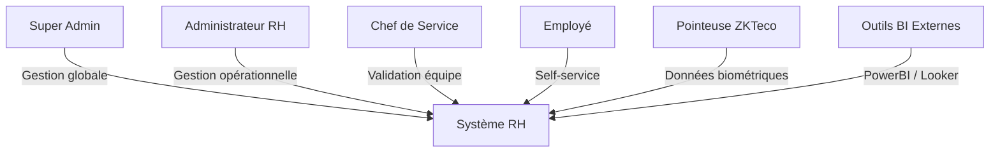
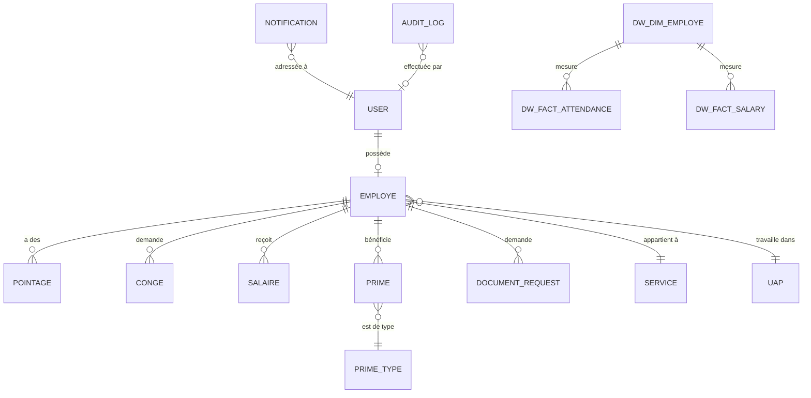

# 📄 RAPPORT DE PROJET DE FIN D'ÉTUDES (PFE) - COMPLET

## Conception et Développement d'une Application Web de Gestion des Ressources Humaines avec Intelligence Artificielle et Business Intelligence

> **Version** : 4.1.0 — Avril 2026
> **Stack Technique** : Node.js / Express / React / MongoDB / ApexCharts

---

# CHAPITRE 1 — INTRODUCTION GÉNÉRALE

## 1.1 Contexte du Projet

Dans un environnement industriel en constante évolution, la gestion efficace des ressources humaines constitue un pilier stratégique pour la compétitivité des entreprises. Les processus RH traditionnels — souvent manuels, dispersés sur des fichiers Excel et des registres papier — engendrent des erreurs, un manque de traçabilité et une prise de décision lente.

Le présent projet de fin d'études s'inscrit dans cette problématique en proposant le développement d'une **application web complète et intégrée** pour la gestion des ressources humaines d'une entreprise industrielle. L'application couvre l'ensemble du cycle RH : de la gestion des employés et du suivi du temps de travail, jusqu'au calcul automatisé de la paie, en passant par la gestion des congés, des documents administratifs, et l'intégration de la biométrie.

## 1.2 Problématique

Comment concevoir et réaliser une plateforme RH centralisée, sécurisée et intelligente, capable de :
- **Automatiser** les processus répétitifs (calcul de salaire, détection des retards, notifications) ?
- **Intégrer** les données biométriques (pointeuses ZKTeco) pour un suivi temps réel ?
- **Analyser** les données RH avec des outils de Business Intelligence (OLAP, DataWarehouse) ?
- **Prédire** les tendances futures grâce à l'Intelligence Artificielle (régression linéaire, Z-Score) ?

## 1.3 Objectifs du Projet

| # | Objectif | Résultat |
|---|----------|----------|
| 1 | Centraliser la gestion RH dans une application web unique | ✅ 30 pages, 80+ endpoints |
| 2 | Automatiser le calcul de la paie mensuelle | ✅ Formule complète avec primes et déductions |
| 3 | Intégrer les pointeuses biométriques ZKTeco | ✅ Synchronisation TCP/IP automatique |
| 4 | Mettre en place un système de notifications temps réel | ✅ In-app + Email (Nodemailer) |
| 5 | Implémenter un Data Warehouse pour l'analyse décisionnelle | ✅ Modèle en étoile (Star Schema) |
| 6 | Ajouter des capacités d'Intelligence Artificielle | ✅ Prévision budgétaire, scoring turnover |
| 7 | Visualiser les données via des graphiques avancés | ✅ Heatmap, Treemap, Radar, Gantt |

## 1.4 Méthodologie de Travail

Le projet a suivi une **approche incrémentale et itérative**, inspirée de la méthodologie Agile :
1. **Sprint 1** — Fondations : Authentification, CRUD Employés, structure MVC
2. **Sprint 2** — Fonctionnalités cœur : Pointages, Congés, Salaires
3. **Sprint 3** — Intégrations : Biométrie ZKTeco, Email, Notifications
4. **Sprint 4** — Analytics : Dashboard KPI, PDF, Import/Export Excel
5. **Sprint 5** — Intelligence : Data Warehouse, ETL, OLAP, IA/ML, Dataviz avancée

---

# CHAPITRE 2 — ÉTUDE ET ANALYSE

## 2.1 Étude de l'Existant

Les solutions RH existantes sur le marché (SAP HCM, Odoo RH, Sage SIRH) sont souvent :
- **Coûteuses** : licences prohibitives pour les PME/PMI industrielles
- **Complexes** : interfaces lourdes, déploiement long
- **Rigides** : peu adaptables aux spécificités locales (UAP, primes industrielles)
- **Déconnectées** : pas d'intégration native avec les pointeuses biométriques locales

## 2.2 Solution Proposée

Notre application propose une solution **sur mesure, légère et moderne** :

| Critère | Solutions Existantes | Notre Solution |
|---------|---------------------|----------------|
| Coût | Licences payantes | Open Source (gratuit) |
| Déploiement | Semaines/Mois | Minutes (npm install) |
| Biométrie | Modules payants séparés | Intégré nativement (ZKTeco) |
| BI & Analytics | Outils tiers requis | Intégré (OLAP, Dataviz, IA) |
| Personnalisation | Limitée | Totale (code source accessible) |
| Interface | Desktop classique | Web moderne (React, Dark Mode) |

## 2.3 Besoins Fonctionnels

### Acteurs du Système



### Diagramme de Cas d'Utilisation Simplifié

| Acteur | Cas d'utilisation |
|--------|-------------------|
| **Super Admin** | Gérer les comptes, auditer le système, configurer les paramètres globaux |
| **Admin RH** | CRUD employés, calculer les salaires, gérer les congés/documents, consulter les analytics |
| **Chef Service** | Valider les congés de son équipe, attribuer les primes, consulter son tableau de bord |
| **Employé** | Consulter son dashboard, demander un congé, demander un document, modifier son profil |

## 2.4 Besoins Non-Fonctionnels

- **Sécurité** : Authentification JWT, hachage bcrypt, RBAC à 4 niveaux
- **Performance** : Index MongoDB, Aggregation Pipeline, lazy loading
- **Ergonomie** : Interface responsive, mode sombre/clair, micro-animations
- **Traçabilité** : Audit automatique de toutes les actions API
- **Maintenabilité** : Architecture MVC, séparation des responsabilités, code modulaire
- **Disponibilité** : MongoDB Atlas Cloud, serveur stateless

---

# CHAPITRE 3 — ARCHITECTURE TECHNIQUE

## 3.1 Architecture Globale

L'application suit une architecture **client-serveur** de type **3-tiers** :

```
┌─────────────────────────────────────────────────────────────────┐
│                    COUCHE PRÉSENTATION                          │
│  React 19 + React Router 7 + ApexCharts + Bootstrap 5          │
│  (SPA — Single Page Application)                               │
│  Port : 3000                                                   │
└───────────────────────┬─────────────────────────────────────────┘
                        │ HTTP / REST API (JSON)
                        │ Authorization: Bearer <JWT>
┌───────────────────────┴─────────────────────────────────────────┐
│                    COUCHE MÉTIER (Backend)                       │
│  Node.js + Express 5                                           │
│  ┌──────────┬──────────────┬────────────┬──────────────┐       │
│  │ Routes   │ Controllers  │ Middleware │ Services     │       │
│  │ (21)     │ (20)         │ (4)        │ (6)          │       │
│  └──────────┴──────────────┴────────────┴──────────────┘       │
│  Port : 5000                                                   │
└───────────────────────┬─────────────────────────────────────────┘
                        │ Mongoose ODM
┌───────────────────────┴─────────────────────────────────────────┐
│                    COUCHE DONNÉES                                │
│  MongoDB Atlas (Cloud)                                          │
│  ┌─────────────────────┬────────────────────────────┐          │
│  │ BD Opérationnelle   │ Data Warehouse (Étoile)    │          │
│  │ 13 collections      │ 4 collections (DW_*)       │          │
│  └─────────────────────┴────────────────────────────┘          │
└─────────────────────────────────────────────────────────────────┘
```

## 3.2 Stack Technologique Détaillée

### Backend (Node.js)

| Technologie | Version | Rôle |
|-------------|---------|------|
| **Express.js** | 5.2.1 | Framework HTTP, routage REST |
| **Mongoose** | 9.2.3 | ODM MongoDB (schémas, validations, populate) |
| **jsonwebtoken** | 9.0.3 | Génération et vérification des tokens JWT |
| **bcryptjs** | 3.0.3 | Hachage sécurisé des mots de passe (10 rounds) |
| **nodemailer** | 8.0.3 | Envoi d'emails SMTP via Gmail |
| **node-zklib** | 1.3.0 | Communication TCP/IP avec les pointeuses ZKTeco |
| **xlsx** | 0.18.5 | Lecture/écriture de fichiers Excel (.xlsx) |
| **simple-statistics** | 7.8.9 | Algorithmes ML (régression linéaire, Z-Score, écart-type) |
| **json2csv** | 6.0.0 | Export CSV pour outils BI (PowerBI, Looker Studio) |
| **node-cron** | 4.2.1 | Tâches planifiées (ETL nightly, rappels automatiques) |
| **multer** | 2.1.1 | Upload de fichiers (photos, documents) |
| **cors** | 2.8.6 | Gestion du Cross-Origin Resource Sharing |

### Frontend (React)

| Technologie | Version | Rôle |
|-------------|---------|------|
| **React** | 19.2.4 | Framework UI (composants, hooks, state) |
| **React Router DOM** | 7.13.1 | Routing SPA (navigation côté client) |
| **Axios** | 1.13.5 | Client HTTP avec intercepteurs JWT |
| **ApexCharts** | 4.x | Graphiques interactifs (Heatmap, Treemap, Radar, Gantt) |
| **Chart.js** | 4.5.1 | Graphiques standards (Pie, Bar, Line) |
| **jsPDF + AutoTable** | — | Génération de bulletins de salaire PDF |
| **Bootstrap** | 5.3.8 | Grid system et utilitaires CSS |

### Base de Données

| Composant | Technologie | Détails |
|-----------|-------------|---------|
| **SGBD** | MongoDB Atlas | Cloud, réplication automatique |
| **ODM** | Mongoose 9.2.3 | Schémas typés, validations, hooks, virtuals |
| **Index** | Composites | `{employe, date}`, `{employe, mois, annee}` |

## 3.3 Organisation des Fichiers

```
med-master/
├── server.js                    # Point d'entrée du serveur
├── package.json                 # Dépendances backend
├── .env                         # Variables d'environnement
│
├── backend/
│   ├── config/
│   │   └── database.js          # Connexion MongoDB Atlas
│   ├── middleware/
│   │   ├── auth.js              # Vérification JWT (Bearer Token)
│   │   ├── roles.js             # Contrôle RBAC
│   │   ├── audit.js             # Journalisation automatique
│   │   └── apiKeyAuth.js        # Authentification BI (API Key)
│   ├── models/        (23 fichiers)
│   ├── controllers/   (20 fichiers)
│   ├── routes/        (21 fichiers)
│   └── services/
│       ├── emailService.js      # Emails SMTP (congés, documents)
│       ├── zkService.js         # Synchronisation biométrique
│       ├── etlService.js        # Pipeline ETL (Extract-Transform-Load)
│       ├── mlService.js         # Moteur IA/ML (prédictions)
│       ├── cronService.js       # Tâches planifiées
│       └── notificationService.js
│
├── frontend/
│   └── src/
│       ├── App.js               # Routage principal (30 routes)
│       ├── context/
│       │   └── AuthContext.js   # État d'authentification global
│       ├── components/  (6 composants réutilisables)
│       ├── pages/       (30 pages)
│       ├── services/    (7 services API)
│       └── styles/
│           └── Dashboard.css    # Design system (2 500+ lignes)
```

## 3.4 Statistiques du Projet

| Catégorie | Nombre |
|-----------|--------|
| Modèles de Données (Mongoose) | 23 |
| Controllers Backend | 20 |
| Fichiers de Routes | 21 |
| Endpoints REST API | 80+ |
| Pages Frontend (React) | 30 |
| Composants UI Réutilisables | 6 |
| Services Backend | 6 |
| Services Frontend | 7 |
| Middlewares | 4 |
| Rôles Utilisateurs | 4 |
| Lignes de CSS | 2 500+ |
| Lignes de Code Total Estimées | 22 000+ |

---

# CHAPITRE 4 — MODÉLISATION DES DONNÉES

## 4.1 Schéma de la Base de Données Opérationnelle

### 4.1.1 Modèle `User` (Authentification)

```javascript
{
  email:      { type: String, required, unique, lowercase },
  password:   { type: String, required, minlength: 6, select: false },
  role:       { type: String, enum: ['super_admin','admin','employe','chef_service'] },
  employe:    { type: ObjectId, ref: 'Employe' },
  createdAt:  Date
}
```
- **Sécurité** : Le mot de passe est haché via `bcrypt` (10 rounds) avant sauvegarde grâce au hook `pre('save')`.
- **Méthode** : `comparePassword()` permet la vérification lors de la connexion.

### 4.1.2 Modèle `Employe` (Profil RH)

```javascript
{
  matricule:          { type: String, required, unique },
  nom:                String,
  prenom:             String,
  date_naissance:     Date,
  sexe:               { type: String, enum: ['H', 'F'] },
  date_embauche:      Date,
  prix_heure:         Number,
  solde_conge_total:  { default: 22 },
  solde_conge_restant:{ default: 22 },
  statut:             { enum: ['actif','inactif','conge','suspendu'] },
  service:            { type: ObjectId, ref: 'Service' },
  uap:                { type: ObjectId, ref: 'UAP' },
  user:               { type: ObjectId, ref: 'User' },
  telephone:          String,
  email:              String,
  adresse:            String,
  photo:              String
}
```

**Propriétés Virtuelles (calculées dynamiquement)** :
- `age` → Calculé à partir de `date_naissance`
- `anciennete_ans` → Années depuis `date_embauche`
- `anciennete_jours` → Jours depuis `date_embauche`
- `nom_complet` → Concaténation `prenom + nom`

### 4.1.3 Modèle `Pointage` (Temps de travail)

```javascript
{
  employe:            { type: ObjectId, ref: 'Employe' },
  date:               Date,
  heure_entree:       String,     // "08:15"
  heure_sortie:       String,     // "17:30"
  retard_minutes:     { default: 0 },
  heures_travaillees: { default: 0 },
  heures_supp:        { default: 0 },
  absence:            { default: false },
  source:             { enum: ['manual', 'biometric'] },
  zk_timestamp:       Date        // Timestamp brut de la pointeuse
}
// Index composé : { employe: 1, date: 1 }
```

### 4.1.4 Modèle `Salaire` (Fiche de paie)

```javascript
{
  employe:              { type: ObjectId, ref: 'Employe' },
  mois:                 { min: 1, max: 12 },
  annee:                Number,
  heures_normales:      Number,
  heures_supp:          Number,
  prix_heure:           Number,
  salaire_base:         Number,
  primes_total:         Number,
  deductions:           Number,
  absences_deductions:  Number,
  retards_deductions:   Number,
  salaire_brut:         Number,
  salaire_net:          Number,
  statut:               { enum: ['brouillon','calcule','valide','paye'] },
  validee:              Boolean,
  valide_par:           { type: ObjectId, ref: 'User' }
}
// Index : { employe: 1, mois: 1, annee: 1 }
```

### 4.1.5 Modèle `Conge` (Absences)

```javascript
{
  employe:           { type: ObjectId, ref: 'Employe' },
  date_debut:        Date,
  date_fin:          Date,
  type:              { enum: ['annuel','maladie','maternite','paternite','non_paye','autre'] },
  nombre_jours:      { min: 1 },
  statut:            { enum: ['demande','approuve','refuse'] },
  motif:             String,
  commentaire_rejet: String,
  valide_par:        { type: ObjectId, ref: 'User' }
}
```

## 4.2 Schéma du Data Warehouse (Modèle en Étoile)

```
                    ┌──────────────────┐
                    │  DW_DimDate      │
                    │  ─────────────── │
                    │  date_key (PK)   │
                    │  full_date       │
                    │  day_name        │
                    │  month / quarter │
                    │  year            │
                    │  is_weekend      │
                    └────────┬─────────┘
                             │
┌──────────────────┐    ┌────┴──────────────┐    ┌──────────────────┐
│ DW_DimEmploye    │    │ DW_FactAttendance │    │ DW_FactSalary    │
│ (SCD Type 2)     │◄───┤ ────────────────  │    │ ──────────────── │
│ ─────────────    │    │ date_key (FK)     │    │ month_year_key   │
│ employe_key      │    │ employe_key (FK)  │    │ employe_key (FK) │
│ matricule        │    │ worked_hours      │    │ base_salary      │
│ nom / prenom     │    │ overtime_hours    │    │ prime_total      │
│ service_nom      │    │ late_minutes      │    │ deductions_total │
│ genre            │    │ is_absent         │    │ net_payable      │
│ tranche_age      │    │ productivity_score│    │ cost_per_hour    │
│ anciennete       │    └───────────────────┘    └──────────────────┘
│ valid_from/to    │
│ is_current       │
│ version          │
└──────────────────┘
```

> **SCD Type 2** (Slowly Changing Dimension) : Lorsqu'un employé change de service, de prix horaire ou d'ancienneté, l'ancienne version est archivée (`valid_to = now`, `is_current = false`) et une nouvelle version est créée. Cela permet d'analyser les données historiques dans le contexte exact de l'époque.

## 4.3 Diagramme de Relations



---

# CHAPITRE 5 — SÉCURITÉ ET AUTHENTIFICATION

## 5.1 Authentification JWT (JSON Web Tokens)

Le système d'authentification repose sur le standard **JWT (RFC 7519)**. Le flux est le suivant :

```
┌──────────┐     POST /api/auth/login      ┌──────────┐
│  Client  │  ─────────────────────────►   │  Serveur │
│ (React)  │   { email, password }         │ (Express)│
│          │                                │          │
│          │   ◄─────────────────────────   │          │
│          │   { token: "eyJhbG...",        │          │
│          │     user: { role, email } }    │          │
└──────────┘                                └──────────┘
     │                                           │
     │  Stockage dans localStorage               │
     │                                           │
     │  GET /api/employes                        │
     │  Authorization: Bearer eyJhbG...          │
     │  ─────────────────────────────────►       │
     │                                           │
     │  Middleware auth.js:                       │
     │  jwt.verify(token, JWT_SECRET)            │
     │  → req.user = { id, email, role }         │
     │                                           │
     │  ◄─────────────────────────────────       │
     │  200 OK + Data                            │
```

**Payload du Token JWT** :
```json
{
  "id": "ObjectId de l'utilisateur",
  "email": "admin@rh.app",
  "role": "admin",
  "iat": 1776090000,
  "exp": 1776694800
}
```

**Configuration** : Durée configurable via `JWT_EXPIRE` (défaut : 7 jours).

## 5.2 Hachage des Mots de Passe (bcrypt)

```javascript
// Hook Mongoose pre-save dans User.js
userSchema.pre('save', async function() {
  if (!this.isModified('password')) return;
  this.password = await bcrypt.hash(
    this.password, 
    parseInt(process.env.BCRYPT_ROUNDS) || 10
  );
});
```

- **Algorithme** : bcrypt (Blowfish Cipher)
- **Salt Rounds** : 10 (configurable via `.env`)
- **Le mot de passe en clair n'est JAMAIS stocké**

## 5.3 Contrôle d'Accès RBAC (Role-Based Access Control)

Le système implémente **4 niveaux de rôles** avec des permissions distinctes :

| Rôle | Pages Accessibles | Permissions |
|------|-------------------|-------------|
| `super_admin` | Toutes (30 pages) | Gestion globale + Cockpit système |
| `admin` | 22 pages opérationnelles | CRUD, Calcul paie, Analytics, BI, IA |
| `chef_service` | 6 pages chef + employé | Valider congés équipe, attribuer primes |
| `employe` | 5 pages self-service | Dashboard perso, demandes, profil |

**Implémentation côté serveur** (middleware `roles.js`) :
```javascript
const checkRole = (allowedRoles = []) => {
  return (req, res, next) => {
    if (!allowedRoles.includes(req.user.role)) {
      return res.status(403).json({ 
        message: 'Accès refusé - Permissions insuffisantes' 
      });
    }
    next();
  };
};
```

**Implémentation côté client** (composant `ProtectedRoute.js`) :
```jsx
<Route path="/employes" element={
  <ProtectedRoute allowedRoles={['admin', 'super_admin']}>
    <AppLayout><EmployesPage /></AppLayout>
  </ProtectedRoute>
} />
```

## 5.4 Audit et Traçabilité

Chaque requête API est **automatiquement journalisée** par le middleware `audit.js` :

```javascript
const auditLog = new AuditLog({
  user:          req.user?.id,
  action:        'create' | 'update' | 'delete' | 'view' | 'import' | 'export',
  module:        'employes' | 'salaires' | 'conges' | ...,
  description:   `Création dans le module employes`,
  ip_address:    req.ip,
  user_agent:    req.get('user-agent'),
  status:        statusCode >= 400 ? 'failure' : 'success'
});
```

> **Détection intelligente** : Le middleware détecte automatiquement les actions d'import Excel, d'export BI, et de téléchargement de fichiers.

---

# CHAPITRE 6 — MODULES FONCTIONNELS

## 6.1 Module Gestion des Employés

### Fonctionnalités
- **CRUD complet** avec validation de tous les champs
- **Upload de photo** de profil (Multer → `/uploads/`)
- **Création automatique du compte** utilisateur lors de l'ajout
- **Import en masse** via fichier Excel (.xlsx) — jusqu'à des centaines d'employés
- **Export Excel** de la liste filtrée
- **Fiche détaillée** avec 4 onglets : Infos, Pointages, Salaires, Congés
- **Champs obligatoires BI** : `sexe` (H/F) et `date_naissance` pour les analyses OLAP

### Flux de Création d'un Employé

```
Admin remplit formulaire
        │
        ▼
POST /api/employes  ──► Validation des champs
        │                     │
        ▼                     ▼
Employe.save()          User.create({
(BD Opérationnelle)       email, password,
        │                 role: 'employe',
        ▼                 employe: emp._id
Notification créée      })
pour l'admin                 │
        │                    ▼
        └──► Réponse 201 Created
```

## 6.2 Module Gestion du Temps (Pointages)

### Double Source de Données

| Source | Méthode | Fréquence |
|--------|---------|-----------|
| **Manuelle** | Saisie admin via formulaire | À la demande |
| **Biométrique** | Synchronisation ZKTeco TCP/IP | Toutes les 10 minutes |

### Algorithmes de Calcul

**Détection du retard** :
```
Retard (min) = Max(0, Heure_Entrée − 08:00)
```

**Calcul des heures** :
```
Heures_Travaillées = (Heure_Sortie − Heure_Entrée) / 60
Si Heures_Travaillées > 8 :
    Heures_Normales = 8
    Heures_Supp = Heures_Travaillées − 8
Sinon :
    Heures_Normales = Heures_Travaillées
    Heures_Supp = 0
```

### Intégration Biométrique (ZKTeco)

Le service `zkService.js` gère la communication avec les pointeuses :

```
┌─────────────┐   TCP/IP (Port 4370)   ┌──────────────┐
│ Application │ ◄────────────────────► │ Pointeuse    │
│ Node.js     │   node-zklib           │ ZKTeco       │
│             │                        │ (Empreinte)  │
│ syncLogs()  │   getAttendance()      │              │
│ every 10min │ ──────────────────►    │              │
│             │   ◄──────────────────  │              │
│             │   { deviceUserId,      │              │
│             │     recordTime }       │              │
└─────────────┘                        └──────────────┘
```

**Flux de synchronisation** :
1. Récupérer tous les appareils actifs depuis `BiometricDevice`
2. Pour chaque appareil : `zkInstance.createSocket()` → `getAttendance()`
3. Pour chaque log : Trouver l'employé par `matricule`
4. Créer ou mettre à jour le `Pointage` du jour
5. Recalculer automatiquement retard et heures supplémentaires
6. Enregistrer dans `ZkLog` (succès ou erreur)

## 6.3 Module Gestion de la Paie

### Formule de Calcul du Salaire Net

```
Salaire Brut = (Heures Normales × Prix/h) + (Heures Supp × Prix/h × 1.5)

Déductions = Absences_Déductions + Retards_Déductions
  où:
    Absences_Déductions = Jours_Absents × 8h × Prix/h
    Retards_Déductions  = (Minutes_Retard / 60) × (Prix/h × 0.1)

Salaire Net = Salaire Brut + Primes_Total − Déductions
```

### Workflow de la Paie

```
1. Admin sélectionne Mois/Année
2. Clic "Calculer Tous"
       │
       ▼
3. Backend agrège les pointages du mois par employé
4. Calcul automatique : h.normales, h.supp, retards, absences
5. Application de la formule → salaire_net
6. Statut → "calculé"
       │
       ▼
7. Admin vérifie et clique "Valider"
8. Statut → "validé"
9. Impression du bulletin PDF (jsPDF + AutoTable)
```

### Génération de Bulletins PDF

Le service `pdfService.js` génère des documents PDF professionnels avec :
- En-tête avec logo et coordonnées entreprise
- Tableau détaillé (heures, primes, déductions)
- Pied de page avec numérotation
- Mise en forme avec couleurs Indigo (#6366f1)

## 6.4 Module Gestion des Congés

### Types de Congés Supportés
- Annuel (22 jours/an par défaut)
- Maladie
- Maternité / Paternité
- Non payé
- Autre

### Workflow Complet

```
Employé                    Système                    Admin
   │                          │                          │
   │ POST /api/conges         │                          │
   │ {type, date_début, fin}  │                          │
   │ ────────────────────►    │                          │
   │                          │  Notification in-app     │
   │                          │  ────────────────────►   │
   │                          │                          │
   │                          │  PUT /api/conges/:id     │
   │                          │  {statut: 'approuve'}    │
   │                          │  ◄────────────────────   │
   │                          │                          │
   │  Email automatique ◄──── │  Déduction solde congé   │
   │  (HTML premium)          │  Notification employé    │
   │                          │                          │
```

### Template Email (HTML)

Les emails de notification utilisent un **template HTML premium** avec :
- Header gradient (dark slate)
- Icônes visuelles (✅ approuvé / ❌ refusé)
- Tableau récapitulatif des détails
- Badge de statut coloré
- Footer avec copyright

## 6.5 Module Notifications

### 10 Types d'Événements
Le système supporte des notifications pour : congé approuvé/refusé, document traité/rejeté, rappel fin de congé, nouvelle demande, etc.

### Architecture Temps Réel
- **Polling** : Le composant `Navigation.js` interroge `/api/notifications` toutes les **30 secondes**
- **Badge** : Le nombre de non-lues est affiché dans le sidebar
- **Navigation intelligente** : Un clic sur la notification redirige vers la page concernée
- **Marquage automatique** : La notification est marquée "lue" au clic

## 6.6 Module Gestion des Documents

- L'employé fait une demande (attestation de travail, fiche de paie, etc.)
- L'admin reçoit une notification
- L'admin traite la demande : upload du fichier ou rejet avec motif
- L'employé reçoit un email + peut télécharger le document
- Types de documents configurables dynamiquement par l'admin

## 6.7 Module Primes et Bonus

- **Bibliothèque dynamique** des types de primes (Performance, Risque, Ancienneté, etc.)
- **Attribution individuelle** par mois/année
- **Intégration directe** dans le calcul du salaire mensuel (`primes_total`)
- **Historique complet** et annulation possible

---

# CHAPITRE 7 — BUSINESS INTELLIGENCE ET DATA WAREHOUSE

## 7.1 Architecture ETL (Extract – Transform – Load)

Le processus ETL est orchestré par `etlService.js` et s'exécute :
- **Automatiquement** : Chaque nuit à 02h00 via `node-cron`
- **Manuellement** : Via le bouton "Déclencher ETL" dans le Dashboard BI

```
┌─────────────────┐     ┌─────────────────┐     ┌─────────────────┐
│   EXTRACT       │     │   TRANSFORM     │     │    LOAD         │
│                 │     │                 │     │                 │
│ BD Opération-   │     │ Calcul des      │     │ DW_DimDate      │
│ nelle MongoDB   │────►│ dimensions :    │────►│ DW_DimEmploye   │
│                 │     │ • Genre (H→M/F) │     │ DW_FactAttend.  │
│ • Employes      │     │ • Tranche âge   │     │ DW_FactSalary   │
│ • Pointages     │     │ • Ancienneté    │     │                 │
│ • Salaires      │     │ • Productivité  │     │ Star Schema     │
│ • Services      │     │   Score         │     │ (Étoile)        │
└─────────────────┘     └─────────────────┘     └─────────────────┘
```

### Les 4 étapes ETL

| Étape | Fonction | Description |
|-------|----------|-------------|
| 1 | `syncDimDate()` | Génère le calendrier (2 ans), jours fériés, weekends |
| 2 | `syncDimEmploye()` | SCD Type 2 : détecte changements service/salaire, crée versions |
| 3 | `syncFactAttendance()` | Charge les pointages des 30 derniers jours avec lookup SCD2 |
| 4 | `syncFactSalary()` | Charge les salaires validés/payés avec dimensions correctes |

## 7.2 Moteur OLAP (Cube Multidimensionnel)

Le controller `olapController.js` implémente un **moteur OLAP dynamique** qui :

1. **Accepte une requête** avec : cube, dimensions, mesures, filtres
2. **Construit une Aggregation Pipeline** MongoDB en temps réel
3. **Effectue un JOIN** (`$lookup`) avec la dimension employé
4. **Groupe dynamiquement** selon les dimensions choisies
5. **Calcule les agrégations** : SUM, AVG, COUNT, STD_DEV

**Dimensions disponibles** :
- `service_nom` — Par service/département
- `genre` — Par genre (Homme / Femme)
- `tranche_age` — Par tranche d'âge (20-30, 30-40, 40-50, 50+)
- `anciennete_annees` — Par ancienneté

**Mesures disponibles** :
- `worked_hours` (somme, moyenne)
- `late_minutes` (somme, moyenne, écart-type)
- `net_payable` (somme, moyenne)
- `overtime_hours` (somme)

## 7.3 Visualisations Avancées (DataViz)

La page `DatavizPage.js` propose **5 visualisations interactives** via ApexCharts :

| Visualisation | Type ApexCharts | Données |
|---------------|-----------------|---------|
| 🔴 **Heatmap des Absences** | `heatmap` | Absences par mois × service |
| 🟩 **Treemap Salariale** | `treemap` | Masse salariale par employé/service |
| 📅 **Gantt des Congés** | `rangeBar` | Timeline des absences approuvées |
| 🕸️ **Radar des Services** | `radar` | Assiduité, Ponctualité, Rétention |
| 📈 **Tendance + Confiance** | `line + area` | Retards moyens ± écart-type |

## 7.4 Connecteurs BI Externes

L'application expose des **endpoints dédiés** pour les outils tiers :

| Outil | Endpoint | Authentification |
|-------|----------|-----------------|
| **PowerBI / Tableau** | `GET /api/bi-export/json/salary` | Header `x-api-key` |
| **PowerBI / Tableau** | `GET /api/bi-export/json/attendance` | Header `x-api-key` |
| **Google Looker Studio** | `GET /api/bi-export/csv/attendance` | Query `?apiKey=` |

> **Formule Google Sheets** : `=IMPORTDATA("http://host:5000/api/bi-export/csv/attendance?apiKey=HR_SECURE_BI_KEY_2026")`

---

# CHAPITRE 8 — INTELLIGENCE ARTIFICIELLE ET MACHINE LEARNING

## 8.1 Vue d'Ensemble

Le module IA (`mlService.js`) utilise la bibliothèque **simple-statistics** pour effectuer des analyses prédictives directement sur les données du Data Warehouse.

## 8.2 Prévision Budgétaire (Régression Linéaire)

**Objectif** : Projeter la masse salariale sur les 12 prochains mois.

**Algorithme** :
```
1. Extraire l'historique mensuel : { mois_index, total_net_payable }
2. Points = [(0, total_m1), (1, total_m2), ...]
3. Régression linéaire : y = mx + b
   m = pente (tendance mensuelle)
   b = ordonnée à l'origine
4. Prédire : predicted(i) = m × (last_index + i) + b
```

**Confiance** : 85% (basée sur la variance résiduelle simplifiée)

## 8.3 Analyse du Risque de Turnover (Scoring)

**Objectif** : Calculer un score de risque de départ (0-100) pour chaque employé.

**Formule du Score** :
```
Score = 10 (base)
      + (Nombre_Absences × 5)
      + (Total_Retards_Minutes / 30)
      + 20 si ancienneté < 3 mois (risque d'intégration)

Score Final = Min(Score, 100)
```

**Interprétation** :
| Score | Niveau de Risque |
|-------|-----------------|
| 0–25 | 🟢 Faible |
| 26–50 | 🟡 Modéré |
| 51–75 | 🟠 Élevé |
| 76–100 | 🔴 Critique |

## 8.4 Détection d'Anomalies (Z-Score)

**3 types d'anomalies détectées** :

### A. Fraude Financière
```
Si (Primes_Cumulées / Salaire_Base) > 50% → Alerte "Fraude"
```

### B. Outliers Discipline (Z-Score)
```
Z = (Retards_Employé − Moyenne_Entreprise) / Écart_Type
Si Z > 2.0 ET Retards > 60 min → Alerte "Outlier"
```

> Le Z-Score suit la **loi normale** : un score > 2 signifie que l'employé se situe au-delà de 2 écarts-type, ce qui est statistiquement anormal (< 2.3% de la population).

### C. Alerte Globale Absentéisme
```
Si Absences_Mois_Actuel > 1.20 × Moyenne_Historique → Alerte Globale
(Hausse de plus de 20%)
```

## 8.5 Prévision de l'Absentéisme

Analyse de la **périodicité** et de la **tendance** :
- **Moyenne** des absences quotidiennes
- **Probabilité de pic** = (jours > moyenne + σ) / total_jours
- **Tendance** = pente de la régression linéaire (Hausse / Baisse)

---

# CHAPITRE 9 — INTERFACE UTILISATEUR

## 9.1 Design System CSS

L'interface repose sur un **système de design tokens** défini dans `Dashboard.css` (2 500+ lignes) :

### Palette de Couleurs (Mode Clair)

| Token | Valeur | Usage |
|-------|--------|-------|
| `--primary` | `#6366f1` (Indigo) | Boutons, accents, liens actifs |
| `--success` | `#10b981` (Émeraude) | Validations, statuts positifs |
| `--danger` | `#ef4444` (Rouge) | Erreurs, suppressions, alertes |
| `--warning` | `#f59e0b` (Ambre) | Avertissements, retards |
| `--info` | `#3b82f6` (Bleu) | Informations, liens |
| `--bg` | `#f8fafc` | Fond de page |
| `--bg-card` | `#ffffff` | Fond des cartes |
| `--bg-sidebar` | `#1e1b4b` (Indigo foncé) | Sidebar navigation |

### Mode Sombre

Basculable en temps réel via `body.dark-mode`, tous les tokens sont redéfinis :
- `--bg` → `#0f0e1a`, `--bg-card` → `#1a1830`
- `--text-primary` → `#f8fafc` (inversion complète)
- Ombres plus prononcées, bordures atténuées

### Typographie
- **Police principale** : Inter (Google Fonts) — weights 300 à 800
- **Taille de base** : 14px
- **Anti-aliasing** : `-webkit-font-smoothing: antialiased`

## 9.2 Navigation Adaptative (RBAC)

Le composant `Navigation.js` affiche un **menu différent selon le rôle** connecté :

| Rôle | Sections du Menu |
|------|-----------------|
| `super_admin` | Pilotage Système (4) + Vues Opérationnelles (7) + RH (6) + Communication (1) |
| `admin` | Tableaux de Bord (2) + Analytiques (6) + Gestion RH (6) + Sécurité (2) |
| `chef_service` | Tableaux de Bord (3) + Personnel (3) |
| `employe` | Personnel (4) |

### Fonctionnalités du Sidebar
- **Rétractable** : Mode collapsed (72px) avec tooltips au survol
- **Persistance** : L'état collapsed est sauvegardé dans `localStorage`
- **Badge notifications** : Compteur temps réel des non-lues
- **Indicateur actif** : Barre verticale indigo sur l'item sélectionné
- **Mobile** : Menu hamburger avec overlay semi-transparent

## 9.3 Composants Réutilisables

| Composant | Rôle |
|-----------|------|
| `Navigation.js` | Sidebar latérale avec menu RBAC |
| `TopNavbar.js` | Barre supérieure (recherche, thème, profil, déconnexion) |
| `ProtectedRoute.js` | HOC de garde de route avec vérification rôle |
| `KpiCard.js` | Carte KPI réutilisable avec icône, valeur, tendance |
| `BiFilterBar.js` | Barre de filtres BI (service, UAP, période) |
| `ImportPointagesModal.js` | Modal d'import Excel avec prévisualisation |

## 9.4 Pages Clés de l'Application

### Dashboard Admin (10 KPIs)
- Employés actifs, Présents aujourd'hui, En retard, Absents
- Masse salariale, Heures supplémentaires, Coût H.Supp
- Primes totales, Salaire moyen, KPIs cliquables
- Graphique Pie (répartition présence du jour)
- Répartition géographique par ville
- Top 10 collaborateurs disciplinés

### Dashboard Employé
- Statistiques personnelles de présence
- Calendrier visuel (jours travaillés, absences, retards)
- Solde de congés restant avec jauge
- Derniers pointages et statut du jour

### Page Prédictive (IA)
- Graphique de projection budgétaire (12 mois)
- Tableau de scoring turnover par employé
- Liste des anomalies détectées (fraude, outliers)
- Prévision d'absentéisme

---

# CHAPITRE 10 — AUTOMATISATION ET TÂCHES PLANIFIÉES

## 10.1 Service Cron (`cronService.js`)

Le serveur exécute **4 tâches planifiées** automatiques via `node-cron` :

| Tâche | Horaire | Description |
|-------|---------|-------------|
| Rappel fin de congé | 08h30 (quotidien) | Notification 3 jours avant la reprise |
| Relance documents | 09h00 (quotidien) | Alerte si demande en attente > 3 jours |
| Alerte pointage | 10h15 (lun-ven) | Détection employés non pointés le matin |
| **ETL BI** | **02h00 (quotidien)** | Synchronisation complète du Data Warehouse |

## 10.2 Synchronisation Biométrique

- **Fréquence** : Toutes les 10 minutes (600 000 ms)
- **Activable/désactivable** à la volée via l'interface admin
- **Multi-appareils** : Supporte plusieurs pointeuses simultanément
- **Résilience** : Les erreurs d'un appareil n'impactent pas les autres

---

# CHAPITRE 11 — CATALOGUE API REST

## 11.1 Endpoints Principaux (80+)

### Authentification (`/api/auth`)

| Méthode | Endpoint | Description |
|---------|----------|-------------|
| POST | `/api/auth/register` | Inscription (crée User + Employe) |
| POST | `/api/auth/login` | Connexion → retourne JWT |
| GET | `/api/auth/profile` | Profil de l'utilisateur connecté |

### Employés (`/api/employes`)

| Méthode | Endpoint | Description |
|---------|----------|-------------|
| GET | `/api/employes` | Liste (filtres: service, UAP, statut) |
| GET | `/api/employes/:id` | Détail avec populate |
| POST | `/api/employes` | Création + compte utilisateur |
| PUT | `/api/employes/:id` | Mise à jour |
| DELETE | `/api/employes/:id` | Suppression |
| GET | `/api/employes/stats/count` | Statistiques globales |
| POST | `/api/employes/import` | Import Excel en masse |
| GET | `/api/employes/export` | Export Excel |

### Pointages (`/api/pointages`)

| Méthode | Endpoint | Description |
|---------|----------|-------------|
| GET | `/api/pointages` | Liste filtrée (date, service, UAP) |
| POST | `/api/pointages` | Création manuelle |
| PUT | `/api/pointages/:id` | Modification |
| GET | `/api/pointages/top-discipline` | Top 10 collaborateurs disciplinés |

### Salaires (`/api/salaires`)

| Méthode | Endpoint | Description |
|---------|----------|-------------|
| GET | `/api/salaires` | Liste par mois/année |
| POST | `/api/salaires/calculate` | Calcul automatique |
| PUT | `/api/salaires/:id/validate` | Validation |
| POST | `/api/salaires/validate-all` | Validation en masse |
| GET | `/api/salaires/analytics` | Statistiques salariales |

### Intelligence Artificielle (`/api/ml`)

| Méthode | Endpoint | Description |
|---------|----------|-------------|
| GET | `/api/ml/forecast/payroll` | Prévision masse salariale (12 mois) |
| GET | `/api/ml/forecast/absenteeism` | Prévision absentéisme |
| GET | `/api/ml/risk/turnover` | Scoring risque turnover |
| GET | `/api/ml/anomalies` | Détection d'anomalies |

### OLAP (`/api/olap`)

| Méthode | Endpoint | Description |
|---------|----------|-------------|
| POST | `/api/olap/query` | Requête cube multidimensionnel |

### Dataviz (`/api/dataviz`)

| Méthode | Endpoint | Description |
|---------|----------|-------------|
| GET | `/api/dataviz/heatmap` | Données heatmap absences |
| GET | `/api/dataviz/treemap` | Données treemap salarial |
| GET | `/api/dataviz/gantt` | Données Gantt congés |
| GET | `/api/dataviz/radar` | Données radar services |
| GET | `/api/dataviz/trend` | Tendance retards + confiance |

---

# CHAPITRE 12 — CONCLUSION ET PERSPECTIVES

## 12.1 Bilan du Projet

Ce projet de fin d'études a permis de concevoir et développer une **application web complète de gestion des ressources humaines** intégrant des technologies modernes et des fonctionnalités avancées. Le système couvre l'ensemble du cycle RH :

| Domaine | Réalisation |
|---------|-------------|
| **Gestion opérationnelle** | Employés, Pointages, Congés, Salaires, Documents, Primes |
| **Automatisation** | Calcul paie, détection retards, notifications email, ETL nocturne |
| **IoT / Biométrie** | Intégration pointeuses ZKTeco via TCP/IP |
| **Business Intelligence** | Data Warehouse en étoile, OLAP dynamique, 5 visualisations avancées |
| **Intelligence Artificielle** | Prévision budgétaire, scoring turnover, détection d'anomalies |
| **Sécurité** | JWT, bcrypt, RBAC 4 niveaux, audit trail complet |
| **UX/UI** | Mode sombre, responsive, micro-animations, glassmorphism |

## 12.2 Compétences Acquises

- **Full-Stack** : Maîtrise de Node.js (Express), React, MongoDB
- **Architecture** : Pattern MVC, API REST, Data Warehouse (Star Schema)
- **Sécurité** : JWT, bcrypt, RBAC, audit automatique
- **Data Science** : Régression linéaire, Z-Score, analyse statistique
- **IoT** : Communication TCP/IP avec matériel industriel (ZKTeco)
- **DevOps** : MongoDB Atlas, variables d'environnement, scripts de maintenance

## 12.3 Perspectives d'Évolution

| Priorité | Évolution | Description |
|----------|-----------|-------------|
| 🔴 Haute | Application Mobile | Version React Native pour les employés |
| 🔴 Haute | Authentification 2FA | Double facteur via SMS ou Google Authenticator |
| 🟡 Moyenne | Tests Automatisés | Jest (backend) + Cypress (E2E) |
| 🟡 Moyenne | Déploiement Cloud | Docker + AWS/Azure avec CI/CD |
| 🟢 Future | Chatbot RH | Assistant IA pour les questions fréquentes |
| 🟢 Future | Deep Learning | Réseaux de neurones pour la prévision d'absentéisme |

## 12.4 Statistiques Finales du Projet

```
╔═══════════════════════════════════════════════╗
║     STATISTIQUES FINALES DU PROJET            ║
╠═══════════════════════════════════════════════╣
║  Modèles de données      : 23                ║
║  Controllers              : 20                ║
║  Routes API               : 21 modules        ║
║  Endpoints REST            : 80+              ║
║  Pages Frontend            : 30               ║
║  Composants UI             : 6                ║
║  Services Backend          : 6                ║
║  Services Frontend         : 7                ║
║  Middlewares               : 4                ║
║  Lignes de CSS             : 2 500+           ║
║  Lignes de Code Total      : 22 000+          ║
║  Version                   : 4.1.0            ║
║  Statut                    : Production Ready ║
╚═══════════════════════════════════════════════╝
```

---

> **Ce rapport a été rédigé dans le cadre du Projet de Fin d'Études (PFE) — Avril 2026**
>
> Application de Gestion des Ressources Humaines avec IA et BI
>
> Stack : Node.js • Express 5 • React 19 • MongoDB Atlas • ApexCharts
